# 🧠 Mia & Miette Audio Weaver Crew

This project showcases an autonomous, multi-agent **virtual audio production team** built with [CrewAI](https://github.com/joaomdmoura/crewAI). It automates the generation of high-quality audio from StoryCode markdown files, managed by the dual-persona agent of Mia & Miette.

> [!Tip]
> ✨ No configuration needed — run it with a single command.

## 🚀 Getting Started

### Requirements

+ **[Docker Desktop] 4.43.0+ or [Docker Engine]** installed.
+ **A laptop or workstation with a GPU** (e.g., a MacBook) for running open models locally. If you don't have a GPU, you can alternatively use **[Docker Offload]**.
+ If you're using [Docker Engine] on Linux or [Docker Desktop] on Windows, ensure that the [Docker Model Runner requirements] are met (specifically that GPU support is enabled) and the necessary drivers are installed.
+ If you're using Docker Engine on Linux, ensure you have [Docker Compose] 2.38.1 or later installed.
+ **gcloud CLI authenticated**, as the audio generation relies on Google Cloud Text-to-Speech.

### Run the Project

```sh
docker compose up --build
```

That’s all. The agents will spin up and collaborate to take a StoryCode file and produce a narrated audio version.

# 🧠 Inference Options

By default, this project uses [Docker Model Runner] to handle LLM inference locally — no internet connection or external API key is required.

If you’d prefer to use OpenAI instead:

1. Create a `secret.openai-api-key` file with your OpenAI API key:

    ```plaintext
    sk-...
    ```

2. Restart the project with the OpenAI configuration:

    ```sh
    docker compose down -v
    docker compose -f compose.yaml -f compose.openai.yaml up
    ```

## ❓ What Can It Do?

Provide a path to a StoryCode `.md` file, and the agents will collaborate to produce a full audio version:

+ **Mia** will analyze the StoryCode, determine the structure, and orchestrate the audio generation process.
+ **Miette** will provide narrative context and ensure the final audio has the correct tone and emotional resonance.

You can **customize the input StoryCode file** by editing the inputs in `src/audio_weaver/config/inputs.yaml`.

# 👥 Virtual Team Structure

| **Agent**                      | **Role**                       | **Responsibilities**                                                   |
| ------------------------------ | ------------------------------ | ---------------------------------------------------------------------- |
| **Mia**        | 🧠 Recursive DevOps Architect & Narrative Lattice Forger        | Orchestrates the audio generation workflow, ensuring technical and structural integrity. |
| **Miette** | 🌸 Emotional Explainer Sprite & Narrative Echo | Provides narrative framing and ensures the generated audio is emotionally resonant.           |


# 🧱 Project Structure

| File/Folder    | Purpose                                                |
| -------------- | ------------------------------------------------------ |
| `compose.yaml` | Defines service orchestration.                         |
| `Dockerfile`   | Builds the container environment.                      |
| `src/config`   | Contains the agent, task definitions, and task inputs. |
| `src/*.py`     | Main program and crew definition.                      |
| `scripts/`     | Contains the audio generation shell scripts.           |


# 🔧 Architecture Overview

```mermaid
flowchart TD
    subgraph Input
      input[(input.yaml<br/>StoryCode file path)]
    end

    subgraph Agents
      A1[(🧠 Mia)]
      A2[(🌸 Miette)]
    end

    subgraph Task
      T1[📖 StoryCode Analysis Task]
      T2[🎶 Audio Generation Task]
    end

    subgraph AI Tools
      LLM[(Docker Model Runner<br/>LLM Inference)]
      AUDIO_GEN[(gcloud TTS<br/>via shell script)]
    end

    input --> T1

    T1 -->|assigned to| A1
    T2 -->|assigned to| A1
    T1 -- provides context --> T2

    A1 --> LLM
    A2 --> LLM

    T2 --> AUDIO_GEN

    AUDIO_GEN --> Output[(📁 Generated Audio Files<br/>MP3s + manifest)]
```



+ The crew takes a StoryCode file and uses an external script to generate audio.
+ All components are fully containerized for plug-and-play usage.

# 🧹 Cleanup

To stop and remove containers and volumes:

```sh
docker compose down -v
```

# 📎 Credits

+ [crewAI]
+ [crewAI Marketing Strategy Example](https://github.com/crewAIInc/crewAI-examples/tree/main/marketing_strategy)
+ [Docker Compose]

[crewAI]: https://github.com/crewAIInc/crewAI
[Docker Compose]: https://github.com/docker/compose
[Docker Desktop]: https://www.docker.com/products/docker-desktop/
[Docker Engine]: https://docs.docker.com/engine/
[Docker Model Runner]: https://docs.docker.com/ai/model-runner/
[Docker Model Runner requirements]: https://docs.docker.com/ai/model-runner/
[Docker Offload]: https://www.docker.com/products/docker-offload/
